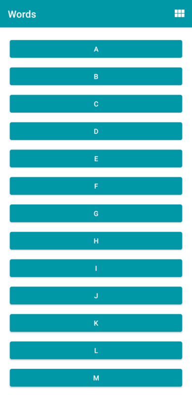
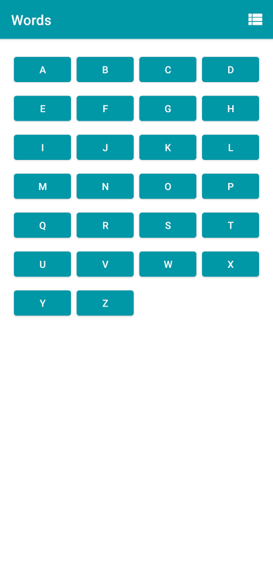
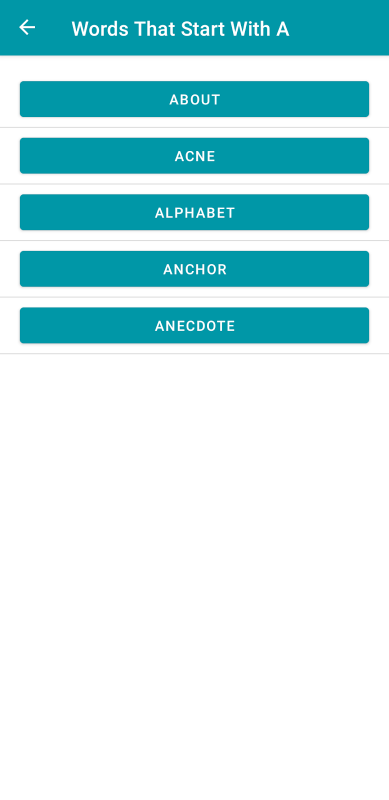
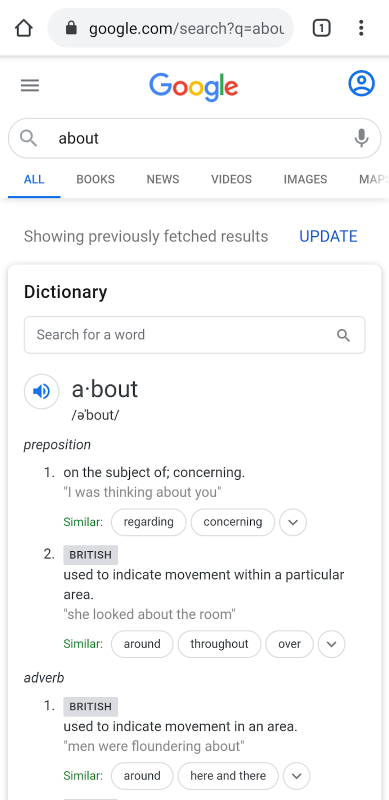

# Words App

#### [Android Basics in Kotlin](https://developer.android.com/courses/android-basics-kotlin/course) - [Unit 3](https://developer.android.com/courses/android-basics-kotlin/unit-3) - [Pathway 2](https://developer.android.com/courses/pathways/android-basics-kotlin-unit-3-pathway-2) - [Activity 2](https://developer.android.com/codelabs/basic-android-kotlin-training-fragments-navigation-component#0) - Fragments and the Navigation Component  
The codelab walks us through how to use fragments within an activity and how to set up and use Navigation Component to help simplify using fragments.  

Other than **App Preview** ( images are from the codelab ), the following was part of the original readme file.
# Introduction
Words app allows you to select a letter and use Intents to navigate to an Activity that
presents a number of words starting with that letter. Each word can be looked up via a web search.

Words app contains a scrollable list of 26 letters A to Z in a RecyclerView. The orientation
of the RecyclerView can be changed between a vertical list or a grid of items.

The app demonstrates the use of Intents in two ways:
* to navigate inside an app by specifying an explicit destination, and,
* allowing Android to service the Intent using the apps and resources present on the device.

# Pre-requisites
* Experience with Kotlin syntax.
* Able to create an Activity.
* Able to create a RecyclerView and supply it with data.

# Getting Started
1. Install Android Studio, if you don't already have it.
2. Download the sample.
3. Import the sample into Android Studio.
4. Build and run the sample.

# App Preview
Linear Layout View    
    
    
Grid Layout View    
    
    
Detail View when Letter A is clicked    
    
    
Implicit Launch when the word ABOUT is clicked     
